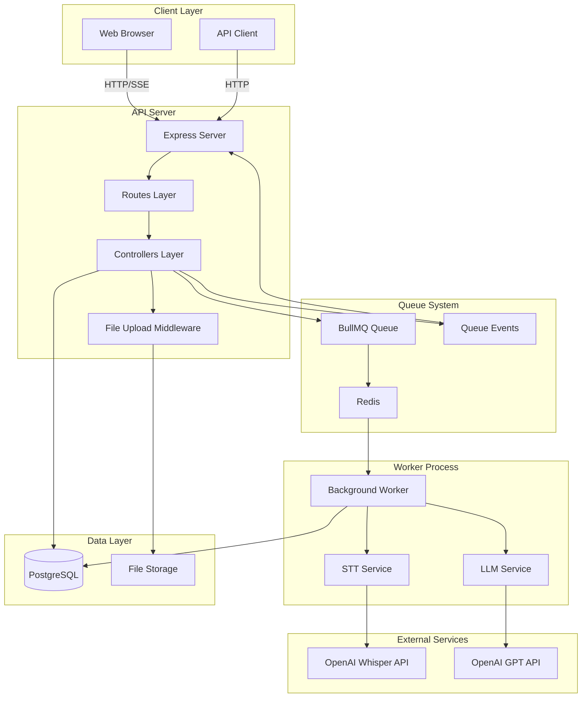
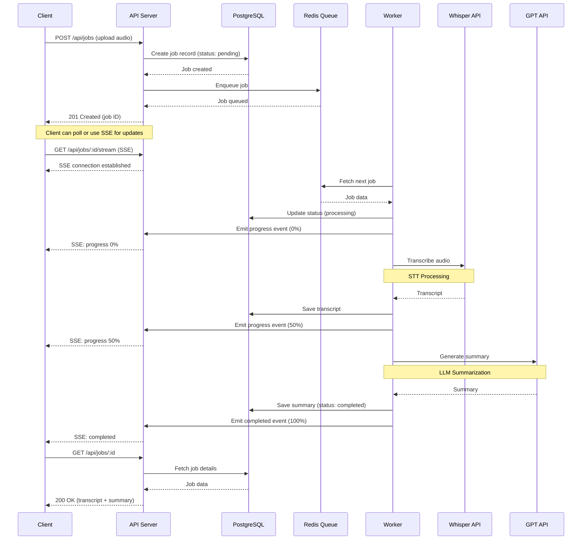

# System Architecture

## Overview

This document describes the architecture and design decisions for the Speech-to-Text Summarization Server.

## System Architecture Diagram



## Sequence Diagram: Job Processing Flow



## Component Architecture

### 1. API Server (`src/server.js`)

**Responsibilities:**
- Handle HTTP requests
- Serve frontend static files
- Route requests to appropriate controllers
- Manage SSE connections
- Health checks

**Technology:**
- Express.js
- CORS middleware
- Static file serving

### 2. Controllers Layer

#### Job Controller (`src/controllers/jobController.js`)

**Responsibilities:**
- Create new transcription jobs
- Retrieve job status and results
- List all jobs with filtering
- Delete jobs
- Queue metrics

#### SSE Controller (`src/controllers/sseController.js`)

**Responsibilities:**
- Establish SSE connections
- Stream real-time job progress
- Listen to queue events
- Handle client disconnections

### 3. Services Layer

#### Queue Service (`src/services/queue.js`)

**Responsibilities:**
- Job queue management (add, get, metrics)
- Queue event handling
- Connection management
- Job retry configuration

**Technology:**
- BullMQ
- Redis (IORedis)

#### STT Service (`src/services/stt.js`)

**Responsibilities:**
- Audio transcription using Whisper API
- File validation
- Retry logic with exponential backoff
- Error handling

**API:** OpenAI Whisper API

#### LLM Service (`src/services/llm.js`)

**Responsibilities:**
- Text summarization using GPT
- Streaming support
- Retry logic
- Prompt management

**API:** OpenAI GPT-4

### 4. Worker Process (`src/worker.js`)

**Responsibilities:**
- Consume jobs from queue
- Coordinate STT and LLM processing
- Update job status in database
- Progress tracking
- Error handling and retry

**Configuration:**
- Concurrency: 2 jobs simultaneously
- Rate limiting: 10 jobs per minute
- Retry attempts: 3 with exponential backoff

### 5. Data Models (`src/models/database.js`)

**Job Model:**
- CRUD operations
- Status management
- Transcript and summary storage
- Progress tracking

**Database Schema:**
```sql
CREATE TABLE jobs (
    id UUID PRIMARY KEY,
    status VARCHAR(20) NOT NULL,
    file_path TEXT NOT NULL,
    file_name TEXT NOT NULL,
    file_size INTEGER,
    mime_type VARCHAR(100),
    transcript TEXT,
    summary TEXT,
    error_message TEXT,
    progress INTEGER DEFAULT 0,
    created_at TIMESTAMP DEFAULT CURRENT_TIMESTAMP,
    updated_at TIMESTAMP DEFAULT CURRENT_TIMESTAMP
);
```

### 6. Configuration (`src/config/index.js`)

Centralized configuration management:
- Server settings
- Database connection
- Redis connection
- OpenAI API credentials
- Upload constraints
- Job processing parameters

## Design Decisions

### 1. Async Job Processing

**Decision:** Use queue-based background processing instead of synchronous request handling.

**Rationale:**
- STT and LLM operations are time-consuming (10-60 seconds)
- Prevents HTTP timeouts
- Enables horizontal scaling of workers
- Better resource utilization
- Retry capability for failed jobs

### 2. BullMQ + Redis

**Decision:** Use BullMQ with Redis for job queue.

**Rationale:**
- Mature and reliable queue system
- Built-in retry and backoff strategies
- Job progress tracking
- Event-based architecture
- Easy monitoring and debugging
- Good performance for moderate workloads

### 3. PostgreSQL for Data Persistence

**Decision:** Use PostgreSQL instead of NoSQL.

**Rationale:**
- Structured data with clear schema
- ACID transactions
- Complex queries (filtering, sorting)
- Reliable and mature
- Good Docker support

### 4. Server-Sent Events (SSE)

**Decision:** Use SSE instead of WebSockets for real-time updates.

**Rationale:**
- Unidirectional communication (server → client)
- Simpler implementation
- Automatic reconnection
- HTTP-based (firewall-friendly)
- Lower overhead than WebSockets
- Built-in browser support

### 5. Modular Service Layer

**Decision:** Separate STT and LLM into independent services.

**Rationale:**
- Single Responsibility Principle
- Easy to test and mock
- Flexible provider switching
- Reusable across projects
- Clear separation of concerns

### 6. Docker Compose

**Decision:** Use Docker Compose for local development and deployment.

**Rationale:**
- Consistent environment across machines
- Easy dependency management
- One-command startup
- Service isolation
- Production-like local development

## Scalability Considerations

### Horizontal Scaling

**API Server:**
- Stateless design
- Can run multiple instances behind load balancer
- Shared Redis and PostgreSQL

**Worker:**
- Can scale independently
- Add more worker containers
- Configure concurrency per worker

### Performance Optimizations

1. **Connection Pooling:**
   - PostgreSQL connection pool (max 20 connections)
   - Redis connection reuse

2. **Retry Strategy:**
   - Exponential backoff
   - Maximum 3 attempts
   - Prevents API rate limiting

3. **Rate Limiting:**
   - 10 jobs per minute at worker level
   - Respects OpenAI API limits

4. **File Cleanup:**
   - Optional automatic deletion after processing
   - Prevents disk space issues

## Security Considerations

1. **API Key Management:**
   - Environment variables only
   - Never committed to version control
   - Docker secrets in production

2. **File Upload Security:**
   - File type validation
   - Size limits (25MB)
   - Unique filenames to prevent collisions
   - Stored outside web root

3. **Database Security:**
   - Isolated Docker network
   - No direct external access
   - Parameterized queries (SQL injection prevention)

4. **Error Handling:**
   - No sensitive information in error messages
   - Stack traces only in development mode

## Monitoring and Observability

1. **Logging:**
   - Structured console logging
   - Job lifecycle events
   - Error tracking

2. **Health Checks:**
   - `/health` endpoint
   - Database connectivity check
   - Docker health checks

3. **Queue Metrics:**
   - Waiting, active, completed, failed counts
   - `/api/queue/metrics` endpoint

## Future Enhancements

1. **Authentication & Authorization:**
   - User accounts
   - API key-based auth
   - Rate limiting per user

2. **Advanced Features:**
   - Multi-language support
   - Custom summarization prompts
   - Batch processing
   - Webhook notifications

3. **Infrastructure:**
   - Kubernetes deployment
   - Prometheus metrics
   - ELK stack for logging
   - S3 for file storage

4. **Performance:**
   - Caching layer (Redis)
   - CDN for frontend
   - Database read replicas

## Testing Strategy

1. **Unit Tests:**
   - Service layer functions
   - Controller logic
   - Database models

2. **Integration Tests:**
   - API endpoints
   - Queue processing
   - Database operations

3. **E2E Tests:**
   - Full job lifecycle
   - SSE streaming
   - Error scenarios

## Deployment

### Development

```bash
docker-compose up
```

### Production

Recommended setup:
- Load balancer (NGINX/HAProxy)
- Multiple API server instances
- Multiple worker instances
- Managed PostgreSQL (RDS)
- Managed Redis (ElastiCache)
- Object storage (S3)
- SSL/TLS termination
- Environment-based configuration

## Conclusion

This architecture provides a solid foundation for a scalable, maintainable speech-to-text summarization service. The modular design allows for easy testing, deployment, and future enhancements while maintaining clean separation of concerns and following industry best practices.
