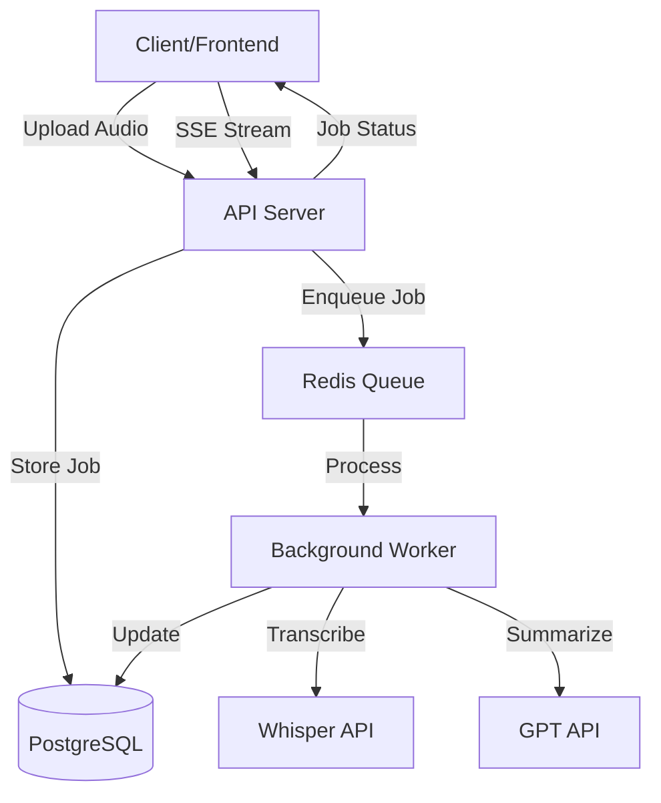

# Speech-to-Text Summarization Server

A robust backend service that accepts audio files, transcribes them using OpenAI Whisper API, generates summaries using GPT, and returns results through a RESTful API with real-time progress streaming.

## Features

- **Audio Transcription**: Converts speech to text using OpenAI Whisper API
- **AI Summarization**: Generates concise summaries using GPT-4
- **Async Processing**: Queue-based job processing with BullMQ and Redis
- **Real-time Updates**: Server-Sent Events (SSE) for live progress tracking
- **RESTful API**: Clean and well-documented API endpoints
- **Docker Support**: One-command deployment with Docker Compose
- **Web Interface**: Simple frontend for uploading and monitoring jobs
- **Database Persistence**: PostgreSQL for reliable data storage

## Technology Stack

- **Runtime**: Node.js 18
- **Framework**: Express.js
- **Database**: PostgreSQL 15
- **Queue**: BullMQ + Redis
- **STT**: OpenAI Whisper API
- **LLM**: OpenAI GPT-4
- **Containerization**: Docker & Docker Compose

## Architecture



## Project Structure

```
.
├── docker-compose.yml          # Docker Compose configuration
├── Dockerfile                  # Container image definition
├── package.json                # Node.js dependencies
├── .env.example                # Environment variables template
├── src/
│   ├── server.js              # API server entry point
│   ├── worker.js              # Background worker entry point
│   ├── config/
│   │   └── index.js           # Configuration management
│   ├── routes/
│   │   └── jobs.js            # API routes
│   ├── controllers/
│   │   ├── jobController.js   # Job CRUD operations
│   │   └── sseController.js   # SSE streaming controller
│   ├── services/
│   │   ├── stt.js             # Speech-to-Text service
│   │   ├── llm.js             # LLM summarization service
│   │   └── queue.js           # Queue management
│   ├── models/
│   │   └── database.js        # Database models
│   └── scripts/
│       └── init.sql           # Database initialization
├── frontend/
│   └── public/
│       └── index.html         # Web interface
└── uploads/                   # Audio file storage
```

## Prerequisites

- Docker (version 20.10+)
- Docker Compose (version 2.0+)
- OpenAI API Key

## Quick Start

### 1. Clone the Repository

```bash
git clone <repository-url>
cd speech-to-text-summarizer
```

### 2. Configure Environment Variables

Copy the example environment file and update it with your OpenAI API key:

```bash
cp .env.example .env
```

Edit `.env` and set your OpenAI API key:

```env
OPENAI_API_KEY=your_openai_api_key_here
```

### 3. Start the Application

```bash
docker-compose up --build
```

This will start all required services:
- **API Server**: http://localhost:3000
- **PostgreSQL**: Port 5432
- **Redis**: Port 6379
- **Background Worker**: Processing jobs

### 4. Access the Application

- **Web Interface**: http://localhost:3000
- **API Documentation**: http://localhost:3000/api
- **Health Check**: http://localhost:3000/health

## API Documentation

### Base URL

```
http://localhost:3000/api
```

### Endpoints

#### 1. Create Job

Upload an audio file for processing.

**Endpoint**: `POST /api/jobs`

**Content-Type**: `multipart/form-data`

**Parameters**:
- `audio` (file, required): Audio file (.wav, .mp3, max 25MB)

**Example Request**:

```bash
curl -X POST http://localhost:3000/api/jobs \
  -F "audio=@/path/to/audio.mp3"
```

**Example Response**:

```json
{
  "success": true,
  "data": {
    "id": "123e4567-e89b-12d3-a456-426614174000",
    "status": "pending",
    "fileName": "audio.mp3",
    "fileSize": 1024000,
    "createdAt": "2024-01-15T10:30:00.000Z"
  },
  "message": "Job created successfully and queued for processing"
}
```

#### 2. Get Job Status

Retrieve the status and results of a specific job.

**Endpoint**: `GET /api/jobs/:id`

**Example Request**:

```bash
curl http://localhost:3000/api/jobs/123e4567-e89b-12d3-a456-426614174000
```

**Example Response**:

```json
{
  "success": true,
  "data": {
    "id": "123e4567-e89b-12d3-a456-426614174000",
    "status": "completed",
    "fileName": "audio.mp3",
    "fileSize": 1024000,
    "mimeType": "audio/mpeg",
    "transcript": "This is the transcribed text from the audio file...",
    "summary": "This is a concise summary of the transcription...",
    "progress": 100,
    "errorMessage": null,
    "createdAt": "2024-01-15T10:30:00.000Z",
    "updatedAt": "2024-01-15T10:31:30.000Z"
  }
}
```

#### 3. Stream Job Progress (SSE)

Get real-time updates on job progress using Server-Sent Events.

**Endpoint**: `GET /api/jobs/:id/stream`

**Example Request**:

```bash
curl -N http://localhost:3000/api/jobs/123e4567-e89b-12d3-a456-426614174000/stream
```

**Example SSE Events**:

```
data: {"type":"connected","jobId":"123e4567-e89b-12d3-a456-426614174000"}

data: {"type":"status","jobId":"123e4567-e89b-12d3-a456-426614174000","status":"processing","progress":20}

data: {"type":"status","jobId":"123e4567-e89b-12d3-a456-426614174000","status":"processing","progress":50,"transcript":"..."}

data: {"type":"done","status":"completed"}
```

#### 4. List All Jobs

Get a list of all jobs with optional filtering.

**Endpoint**: `GET /api/jobs`

**Query Parameters**:
- `status` (optional): Filter by status (pending, processing, completed, failed)
- `limit` (optional): Maximum number of results

**Example Request**:

```bash
curl "http://localhost:3000/api/jobs?status=completed&limit=10"
```

**Example Response**:

```json
{
  "success": true,
  "data": [
    {
      "id": "123e4567-e89b-12d3-a456-426614174000",
      "status": "completed",
      "fileName": "audio.mp3",
      "fileSize": 1024000,
      "progress": 100,
      "createdAt": "2024-01-15T10:30:00.000Z",
      "updatedAt": "2024-01-15T10:31:30.000Z"
    }
  ],
  "count": 1
}
```

#### 5. Delete Job

Delete a job and its associated files.

**Endpoint**: `DELETE /api/jobs/:id`

**Example Request**:

```bash
curl -X DELETE http://localhost:3000/api/jobs/123e4567-e89b-12d3-a456-426614174000
```

**Example Response**:

```json
{
  "success": true,
  "message": "Job deleted successfully"
}
```

#### 6. Get Queue Metrics

Get metrics about the job queue.

**Endpoint**: `GET /api/queue/metrics`

**Example Response**:

```json
{
  "success": true,
  "data": {
    "waiting": 2,
    "active": 1,
    "completed": 50,
    "failed": 3,
    "delayed": 0
  }
}
```

## Job Status Flow

```
pending → processing → completed
                    ↓
                  failed
```

- **pending**: Job is queued and waiting to be processed
- **processing**: Job is currently being transcribed and summarized
- **completed**: Job finished successfully with transcript and summary
- **failed**: Job encountered an error during processing

## Development

### Running Locally (without Docker)

1. Install dependencies:

```bash
npm install
```

2. Start PostgreSQL and Redis (locally or via Docker)

3. Set environment variables in `.env`

4. Initialize database:

```bash
psql -U postgres -d stt_summarizer -f src/scripts/init.sql
```

5. Start API server:

```bash
npm start
```

6. Start worker (in another terminal):

```bash
npm run worker
```

### Development Mode with Auto-Reload

```bash
npm run dev        # API server with nodemon
npm run dev:worker # Worker with nodemon
```

## Configuration

All configuration is managed through environment variables. See `.env.example` for available options:

| Variable | Description | Default |
|----------|-------------|---------|
| `PORT` | API server port | 3000 |
| `POSTGRES_HOST` | PostgreSQL host | postgres |
| `POSTGRES_DB` | Database name | stt_summarizer |
| `REDIS_HOST` | Redis host | redis |
| `OPENAI_API_KEY` | OpenAI API key | (required) |
| `MAX_FILE_SIZE` | Max upload size in bytes | 26214400 (25MB) |
| `JOB_ATTEMPTS` | Max retry attempts | 3 |

## Error Handling

The API uses standard HTTP status codes:

- `200`: Success
- `201`: Resource created
- `400`: Bad request (invalid input)
- `404`: Resource not found
- `500`: Internal server error

Error responses include detailed messages:

```json
{
  "success": false,
  "error": "Error type",
  "message": "Detailed error message"
}
```

## Testing

### Manual Testing with cURL

Create a job:

```bash
curl -X POST http://localhost:3000/api/jobs \
  -F "audio=@test-audio.mp3"
```

Check job status:

```bash
curl http://localhost:3000/api/jobs/{job-id}
```

Stream job progress:

```bash
curl -N http://localhost:3000/api/jobs/{job-id}/stream
```

## Troubleshooting

### Docker Issues

**Problem**: Containers fail to start

```bash
# Check logs
docker-compose logs

# Rebuild containers
docker-compose down
docker-compose up --build
```

### Database Connection Issues

**Problem**: Cannot connect to PostgreSQL

```bash
# Check if PostgreSQL is running
docker-compose ps

# Check database logs
docker-compose logs postgres
```

### Worker Not Processing Jobs

**Problem**: Jobs stuck in pending status

```bash
# Check worker logs
docker-compose logs worker

# Check Redis connection
docker-compose logs redis
```

### OpenAI API Issues

**Problem**: Transcription or summarization fails

- Verify your OpenAI API key is correct in `.env`
- Check if you have sufficient API credits
- Review worker logs for specific error messages

## Performance Considerations

- **Concurrent Processing**: Worker processes up to 2 jobs simultaneously
- **Rate Limiting**: Max 10 jobs per minute to respect API limits
- **File Size**: Audio files limited to 25MB (Whisper API constraint)
- **Retry Logic**: Failed jobs are retried up to 3 times with exponential backoff

## Security Considerations

- API keys stored in environment variables (never committed to git)
- File type validation on upload
- File size limits enforced
- Database credentials isolated in Docker network
- CORS enabled for frontend integration

## License

MIT

## Contributing

Contributions are welcome! Please feel free to submit a Pull Request.

## Support

For issues and questions, please open an issue on GitHub.

---

**Developed as a backend interview assignment demonstrating:**
- ✅ System architecture design
- ✅ Async job processing with queues
- ✅ RESTful API design
- ✅ Real-time streaming with SSE
- ✅ Docker containerization
- ✅ Clean code structure and documentation
